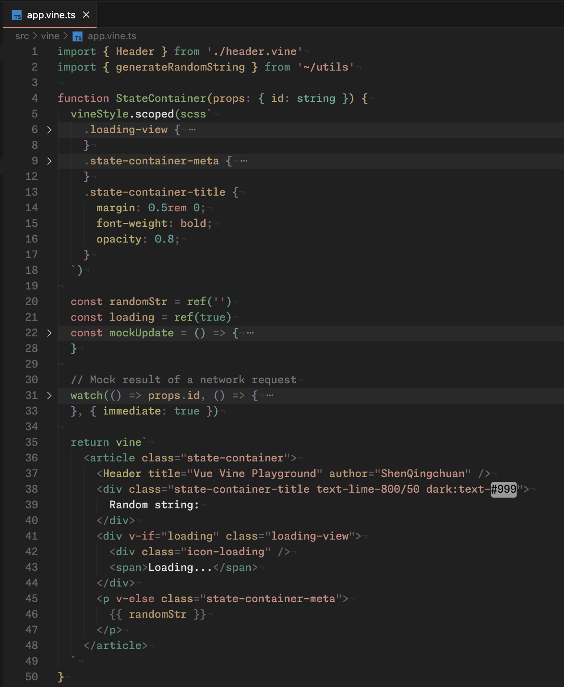

# Vue Vine

- [Contribution Guide](./CONTRIBUTING.md)
- [中文 README](./README-CN.md)

Another style of writing Vue components.

- NPM version: &nbsp; [](https://www.npmjs.com/package/vue-vine)
- VSCode extension: &nbsp; [](https://marketplace.visualstudio.com/items?itemName=shenqingchuan.vue-vine-extension)
- Check more details in docs: &nbsp; [](https://app.netlify.com/sites/vue-vine/deploys)

<details>
  <summary>
    <b>Why this ?</b>
  </summary>
  <br>

  There are many discussions in community that hopes for a solution that supports writing multiple Vue components in a single file. That's why `Vue Vine` was born.

  `Vue Vine` was designed to provide more flexibility of managing Vue components. It is a parallel style to SFC.

  Take a quick view:

  

</details>

## Relavant packages

| Package | Version | Description |
| --- | --- | --- |
| [@vue-vine/compiler](./packages/compiler) | [](https://www.npmjs.com/package/@vue-vine/compiler) | Compiler |
| [@vue-vine/language-server](./packages/language-server) | [](https://www.npmjs.com/package/@vue-vine/language-server) | Language Server |
| [@vue-vine/language-service](./packages/language-service) | [](https://www.npmjs.com/package/@vue-vine/language-service) | Language Service |
| [@vue-vine/vite-plugin](./packages/vite-plugin) | [](https://www.npmjs.com/package/@vue-vine/vite-plugin) | Vite Plugin |
| [@vue-vine/eslint-parser](./packages/eslint-parser) | [](https://www.npmjs.com/package/@vue-vine/eslint-parser) | ESLint Parser |
| [@vue-vine/eslint-plugin](./packages/eslint-plugin) | [](https://www.npmjs.com/package/@vue-vine/eslint-plugin) | ESLint Plugin |
| [@vue-vine/eslint-config](./packages/eslint-config) | [](https://www.npmjs.com/package/@vue-vine/eslint-config) | ESLint Config |
| [@vue-vine/nuxt](./packages/nuxt-module) | [](https://www.npmjs.com/package/@vue-vine/nuxt) | Nuxt Module |
| [vue-vine-tsc](./packages/tsc) | [](https://www.npmjs.com/package/vue-vine-tsc) | TypeScript CLI checker |

## Install

```bash
# If you didn't install `@antfu/ni` yet, I highly recommend you to install it.
ni -D vue-vine
```

Use the plugin in `vite.config.ts`:

```ts
import { VineVitePlugin } from 'vue-vine/vite'

export default defineConfig({
  plugins: [
    // ...Other plugins
    VineVitePlugin()
  ],
})
```

Then add macro's type definition in `tsconfig.json`:

```json
{
  "compilerOptions": {
    "types": ["vue-vine/macros"]
  }
}
```

For ESLint, install our custom ESLint config:

```bash
ni -D @vue-vine/eslint-config
```

You need to load the config into your flat configs.

```js
import antfu from '@antfu/eslint-config'

// `VueVine()` returns a ESLint flat config
import VueVine from '@vue-vine/eslint-config'

export default antfu(
  {
    // First option is not Linter.FlatConfig,
    // it's a setting for antfu's config itself
  },
  ...VueVine(),
)
```

Finally, install the VSCode extension, search `Vue Vine` in the marketplace.


## Try the demo

You can try the demo by following steps:

For development environment setup, first you need to get the VSCode extension bundle ouput.

```bash
git clone https://github.com/vue-vine/vue-vine.git
cd vue-vine
pnpm install

# Build all the required packages
pnpm run build

# Build the VSCode extension
pnpm run build:ext
```

After building the VSCode extension, you can open the 'Debug' tab in VSCode, and start the **'Run Vine Extension'** debug session.


Then start the Playground's dev server in another terminal session.

```bash
pnpm run play
```

1. You can see the demo in `http://localhost:3333/`.
2. You can inspect the transforming process in `http://localhost:3333/__inspect/`
